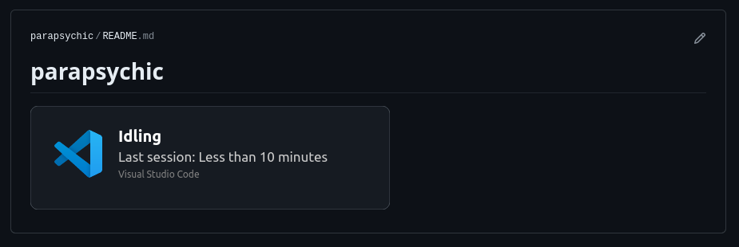

# IShowOff
Ever felt the urge to show your programming session time to the world to flex on them normies?

You could either use a Discord RPC extension like a normal human being, or announce to the world like a total lunatic.

If you are a total lunatic, then I've got good news for you my friend.

Introducing ishowoff.

It's like Discord RPC but for Github.

Shows your last programming session details on your Github Profile:


## What does it do?
It displays your recent programming session details with a nice little card on your profile.

It's like ishowspeed, but instead of showing off 🥩, it shows off your programming session details.


## Setup
This is a two-part setup. 

You need a extension running on your editor for this to work. At the moment, I have only made the VS Code extension, which is funny, because I developed this on neovim. I should probably start studying Lua.

1. Fork this repo.
2. Go to Actions tab and enable workflows.
3. Add the following to your GitHub profile readme:
```html
<a target="_blank" rel="noopener noreferrer nofollow" href="https://github.com/parapsychic/ishowoff/">
  
</a>
```
4. Install the appropriate extension: [VS Code Extension](https://marketplace.visualstudio.com/items?itemName=parapsychic.ishowoff).
5. Follow the setup as mentioned in the extension readme. For VS Code, [click here](https://github.com/parapsychic/ishowoff_vscode).

### Arguments
You can customize the svg by supplying the following arguments either directly from the extension (recommended) or by modifying the github action (not recommended).

```
USAGE:
        For defaults, supply only the timestamp: ishowoff starttime=10:00
        	Theme:                    theme=[dark,light]
        	Background color:         bg-primary
        	Background stroke:        bg-stroke
        	Language:                 lang
        	Workspace text color:     primary-color
        	Workspace text font:      primary-font
        	Workspace text:           primary-text
        	Timestamp color:          session-color
        	Session text font:        session-font
        	Explicitly set timestamp: session-text-time
        	Editor text color:        editor-color
        	Editor text font:         editor-font
        	Editor text:              editor-text
```

### Themes
Right now, only default dark/light themes are supported. But you can painstakingly set the arguments to create any theme you want.

By default, while setting your own arguments, dark theme will be used as the base theme in case you do miss any of the arguments. To override this, use theme=light.

### Some known issues:
The svg on your profile might not be immediately updated. This has something to do with the way Github works. 

Workarounds:
- Have the github action commit to your readme repo. But if you use some other similar readme editing actions, it might cause issues.
- Or you could always host it on your own server or something and everytime the action generates the svg file, send it to your server.

## Todo:
Use the build workflow's artifact to run instead of committing binary. Run a cron job every 90 days to prevent artifact deletion.

## Problems?
It Just Works<sup>TM</sup>  


But in case it doesn't, [click here](https://newfastuff.com/wp-content/uploads/2019/05/5p3oYv1.png) or open an issue and cross your fingers.

Built with ❤️ and Rust

<sup>Hire me Bethesda, I'll work for minimum wage.</sup>

<a href="https://youtu.be/Eweu-mHzmq4?si=pAnmXEZV0725b7rS" target="_blank" rel="noopener"></a>


🫰 Inspired by my friend who never powers off his laptop and idles on Visual Studio for 42 hours.

✨ Actual implementation inspired by [jamesgeorge007/github-activity-readme](https://github.com/jamesgeorge007/github-activity-readme).
